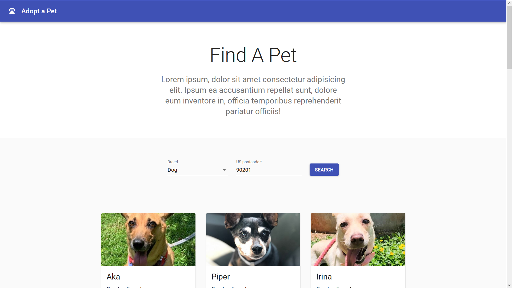
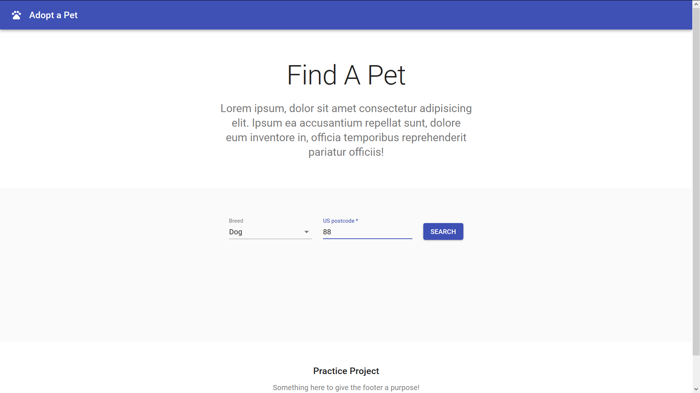
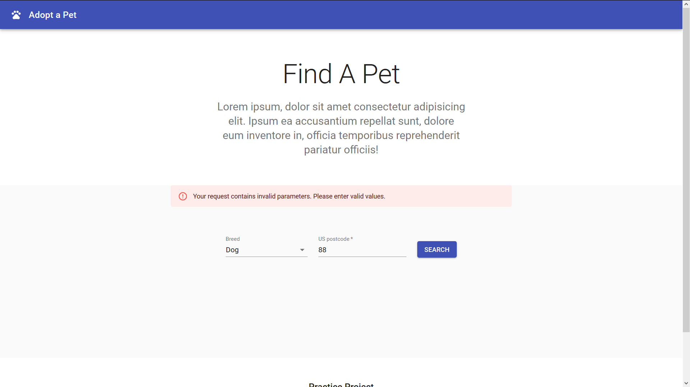

# third

This is a small responsive app made in React, Typescript and Material-UI for finding pets for adoption. It uses Petfinder API (https://www.petfinder.com/developers/v2/docs/), so if you want to use it make sure to first create an account on their website. You will receive API key and secret, and make sure to insert yours instead of mine in file `form.tsx`. 

If you are interested to take a closer look, clone this repo or download the .zip file, and run in the terminal: `npm run build`.

## Screenshots:
 

## Technologies
React, Typescript, Material-UI